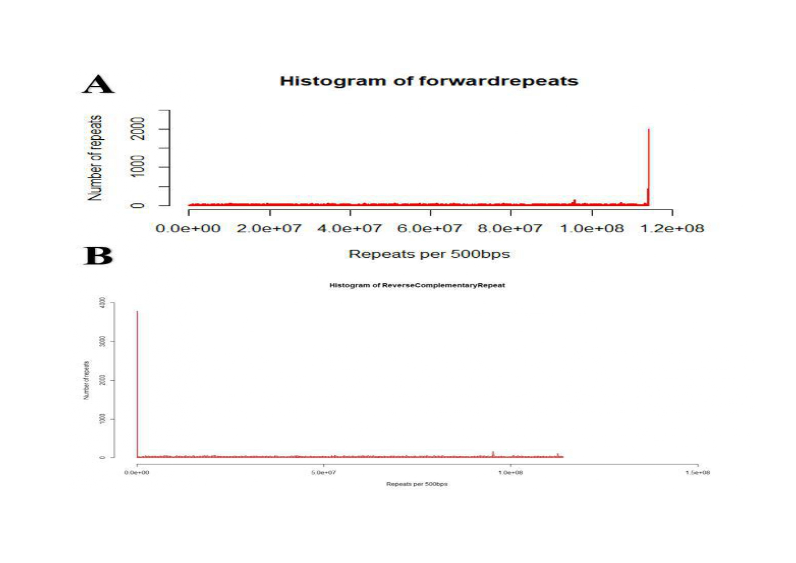

# 🧬 Telomeric Repeat Analysis Project

Welcome to my B.Tech thesis project! This research focuses on identifying telomeric repeat patterns (like `TTAGGG`) in the genomes of 28 diverse organisms using **R programming**.

## 📘 Project Summary

- Telomeric repeats are essential for chromosome stability and play a role in **aging and genome organization**.
- Using a custom R script, I analyzed the presence of forward and reverse telomeric repeats in genome FASTA files.
- Repeats were counted and visualized using a bar chart.
- Data was exported for further study and comparison.

## 🧪 Tools & Technologies

- **R programming** (`seqinr` package)
- **FASTA genome data** from NCBI
- **Bar plots** and CSV export
- **GitHub Pages** to present the work

## 📂 Files Included

- 📄 [B.Tech Thesis (PDF)](B.Tech%20Thesis.pdf) – Full thesis report
- 📜 [R Script](R code for using sequinr for telomere analysis.R) – Code used to detect repeat positions

## 📈 Sample Output Plot

*(Upload a plot image and rename it to `plot.png`, then uncomment below)*

<!--  -->

## 👨‍🎓 Author

**Jyothi Swaroop C**  

> This project is a part of my undergraduate thesis work under the guidance of Dr. S. Sudhakar, Manonmaniam Sundaranar University, and Mrs. N. Bharathi, TNAU.

